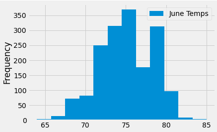
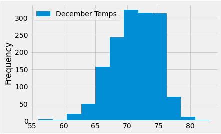
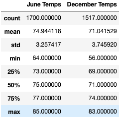
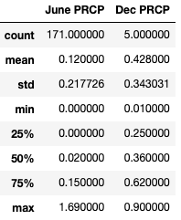
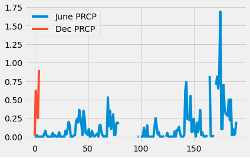

## Surfs UP!
 

Tyrone Fraley 
UC Berkley Extension 
August 31, 2022 

 

  

 
## Overview 
Recently, I was on vacation in Hawaii. I discovered I had a passion for surfing during this trip and since then I have been planning to move to Hawaii. To do this I have been working on creaing a plan to move to Hawaii and start a business. The plan is to start a Surf and Shake shop that will serve surfboards and ice cream to customers. To accomplish this I will need to get an investor on board so I developed a solid business plan. However, once I did this and found an investor named W.Avy who is known for his love for surfing. W. Avy brought up a really good point to me - the weather in Hawaii. He later explained to me that he had a past venture (surf shop in Hawaii) and it was ultimately closed down due to weather conditions. He asked me if I could run some analytics from weather data he collected on every island in Hawaii. After analyzing the data and then discovering that Oahu would be the best place to start a business in Hawaii, W. Avy asked if I could drill down a bit more on Oahu. This time around he wanted to know about the temperature for the months of June and December to determine if the surf and ice cream business would be sustainable year-round.

## Results
The analysis was interesting, in that I could now see what the weather is like in Oahu year-round based on temperature. However, this was not enough - I also wanted to check out the percipitation during those months as well. Understanding what tools I would need for this analysis. I used Python, Pandas, and SQLite/SQLAlchemy to analyze the data. The analysis for the temperature and precipitation called for the following: 
         
    * Analyze the temperatures for December. 
             
        * December temp. deliverable code: december_temps_lst = session.query(Measurement.date, Measurement.tobs).filter(extract('month', Measurement.date)== 12).all() 
                 
    * Analyze the temperatures for June. 
             
        * June temp. deliverable code: june_temps = session.query(Measurement.date, Measurement.tobs).filter(extract('month', Measurement.date) == 6).all() 
                 
    * Analyze the percipitation for June and December in 2017. 
             
        * December prcp deliverable code: year_2017 = dt.date(2017, 12, 31) - dt.timedelta(days=365) | Dec_prcp_2017 = session.query(Measurement.date, Measurement.prcp).filter(Measurement.date >= year_2017).filter(extract('month', Measurement.date)==12) 
                 
        * June prcp deliverable code: June_prcp_2017 = session.query(Measurement.date, Measurement.prcp).filter(Measurement.date >= year_2017 ).filter(extract('month', Measurement.date)==6) 
        

## Summary

### Temperature
I started the analysis by importing my dependencies, Python SQL tool kit and relational mapper. This allowed me to pull the SQLlite file "sqlite:///hawaii.sqlite" which was represented in my jupyter notebook as "engine." From this point i reflexted an existing database into a new model through the automap_base() function. In turn, reflecting the table was essential. According to SQLAlchemy (N.D.), "A Table object can be instructed to load information about itself from the corresponding database schema object already existing within the database." Now that I could access the keys (Base.classes.keys()) I knew that I was working with "measurement" and "station." Which were then placed into tables (Measurement = Base.classes.measurement, Station = Base.classes.station). At this point in the analysis I could move forward with creating a session link from Python to the database. 
To determine the statistics for June I first imported sqlalchemy's extract function. At this point I was now able to not only extract information for June, but for December as well. I wrote two queries (one for June and one for December) which would extract the temperature data for each month in Oahu. However, both months had their own separate queries. In a nut shell I used the following function and adjusted the extraction's (.filter(extract()) integer to reflect the month I wanted to extract session.query(Measurement.date, Measurement.tobs).filter(extract('month', Measurement.date) == 6).all(). Once I completed this portion of the analysis, I plotted both of the data frames I created for December and June's temperatures. At this point of the analysis I wanted to compare the data for both months. To do this I first placed both data frames into a list and placed them into a variable named "frames." To maintaint continuity the june_temp_df was first in the list so that when I would create a data frame June would come before December. I then combined the data frames by using pd.concat() to place them into one single data frame called "june_dec_temps_df." Finally I observed the statistical data side-by-side in my newly build data frame. The interesting thing is that when it comes to temperature June and December were not far off from eachother. The mean temperatures were 74 degrees for June and 71 degrees for December. That sounds like some great weather!

 

  

 

 

  

 
Now that I had the temperatures completed I wanted to take a deeper dive, because W. Avy mentioned losing his surf shop to some serious rain in the past. So now precipitation was on my radar. Albeit, the query searches were similar to what was used for temperature by month (session.query(Measurement.date, Measurement.prcp).filter(Measurement.date >= year_2017).filter(extract('month', Measurement.date)==12). My queries would be a bit more expansive (session.query(Measurement.date, Measurement.prcp).filter(Measurement.date >= year_2017 ).filter(extract('month', Measurement.date)==6). This time I inducted two filters to complete my query. One filter would grab the year and the other would grab the month. to obtain the given year (2017) I used the following code : year_2017 = dt.date(2017, 12, 31) - dt.timedelta(days=365). This could would use datetime to calculate December 31st, 2017 minus 365 days. The results were interesting after I extracted the data and put the data in it's respective data frame. Like the temperature dataframes I used .concat to combine the precipitation data frames as well. The interesting thing was that precipitation was actually higher on average in December (0.42) than June (0.12). 
 

  

 

In conclusion I can see that the temperature in Oahu is quite in my favor throughout the year. This is considering that it is on average in the 70's. In addition, precipitation looks to be descent as well. I am happy to say that Oahu will be the location for my new business and I highly appreciate that W. Avy wanted to take our time and dive into the weather data before launching the business.

## Reference

SQL Alchemy.(N.D.).https://docs-sqlalchemy.readthedocs.io/ko/latest/core/reflection.html

